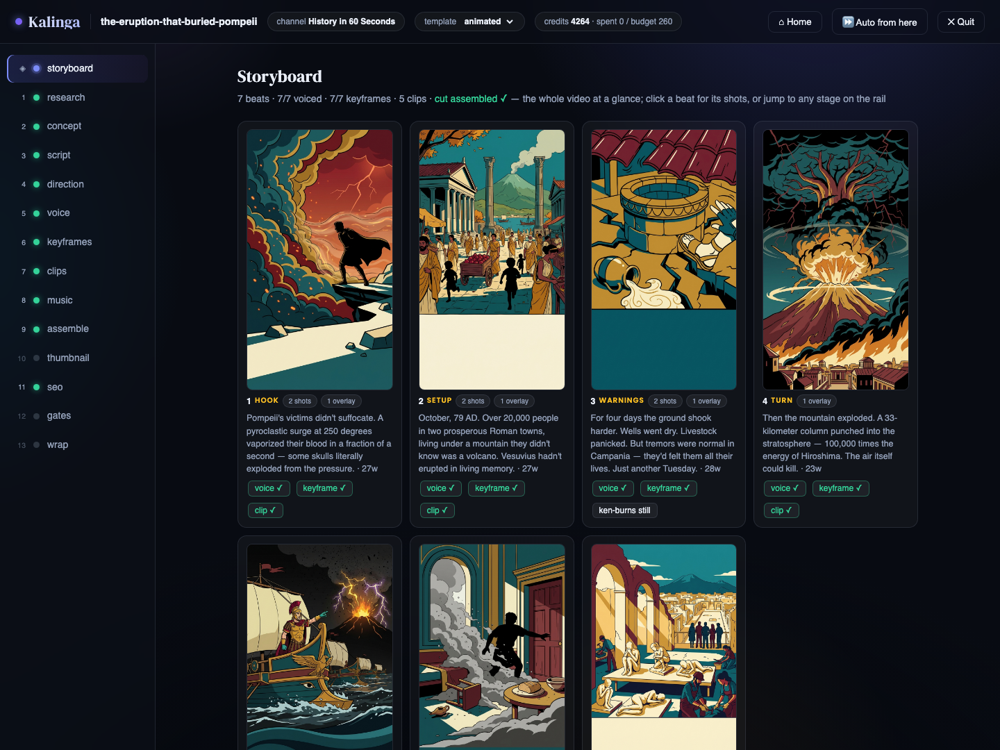
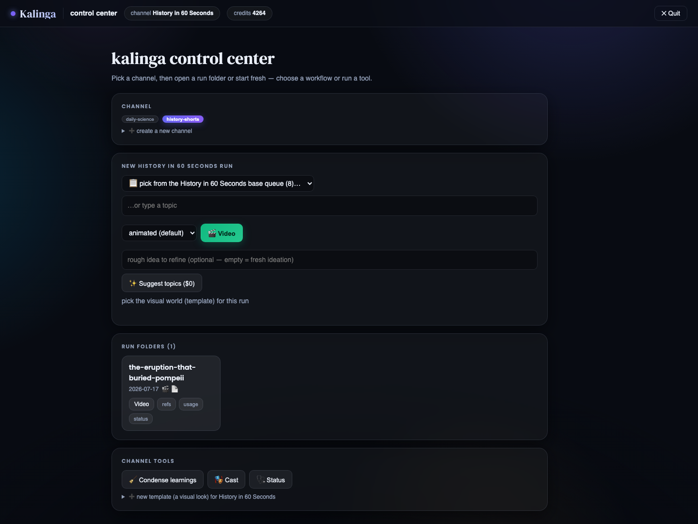
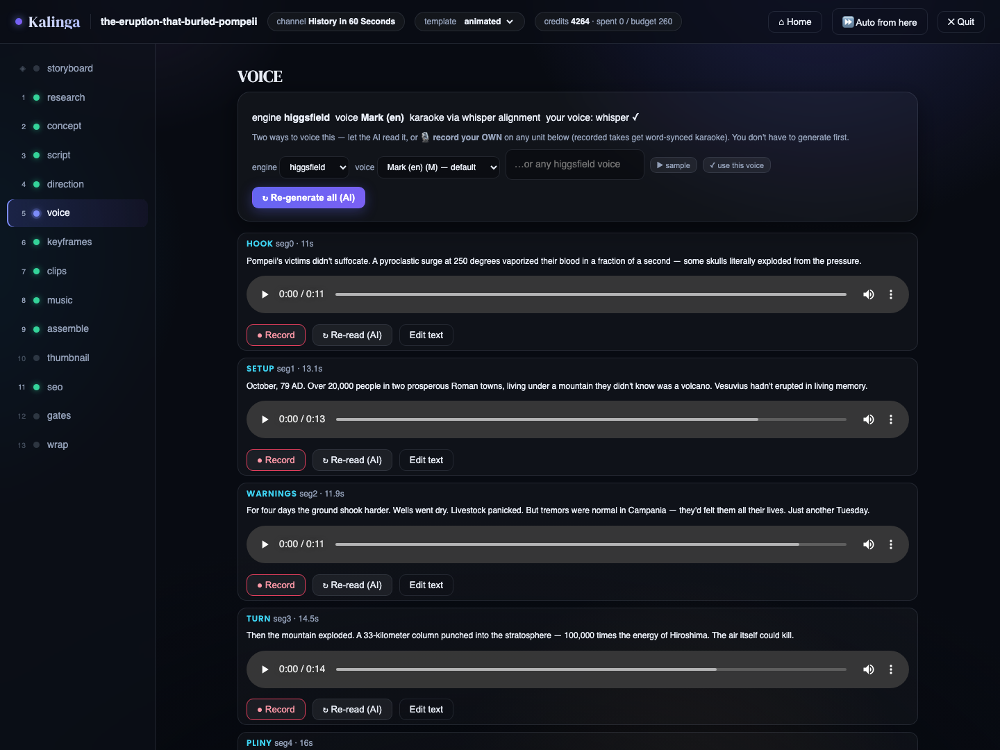
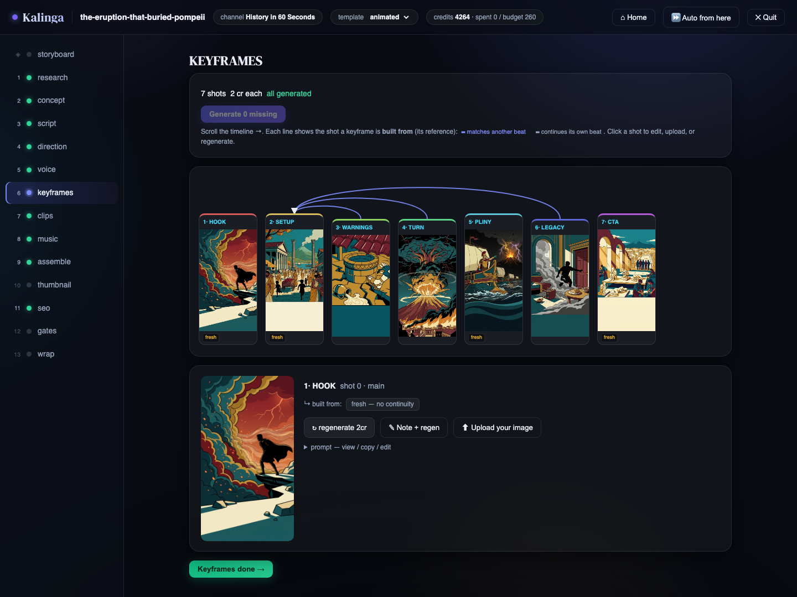
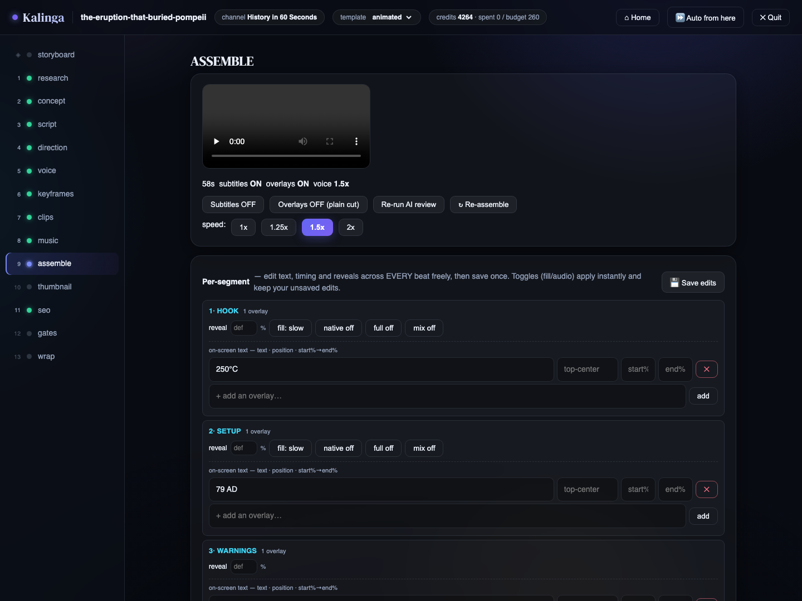

# Kalinga — an open-source AI Shorts factory

Turn one topic into a finished, upload-ready vertical video (YouTube Shorts,
TikTok, Reels) — an AI video generator for running faceless channels
end-to-end. Kalinga is a **channel-agnostic pipeline**: you describe a
channel once — its premise, voice, beat structure and look — and the pipeline
researches a topic, writes a script, directs the visuals, generates the
keyframes/clips/voiceover, and assembles a captioned 1080×1920 cut.

```
research → script → direction → voice → keyframes → clips → assemble → SEO → validate
```

- **Creative** (script, direction, judging, SEO) runs on your **Claude**
  subscription via the `claude` CLI — $0 marginal cost.
- **Generation** (images, video, TTS) runs through **Higgsfield** via the
  `higgsfield` CLI — the only part that spends credits (~180–240 per video).



> This is the open-source core. It is deliberately focused on the **video
> creation workflow**. Analytics/experiment loops, publishing automation,
> carousels, data-chart overlays and any channel-specific research (finance,
> etc.) are intentionally not included — the extension points below make them
> straightforward to add back for your own use.

## Two ways to drive it

Everything has **two modes** — pick whichever fits the moment, they share the
same artifacts and resume each other freely:

- **UI** — `python3 kalinga.py ui` opens a local browser control center (a
  stdlib HTTP server, no extra deps): pick a channel, explore finished runs on
  a storyboard, edit any stage, create channels/templates/cast, and produce
  videos stage-by-stage with previews at every step.
- **CLI** — `ship` (headless one-shot), `make` (interactive in the terminal),
  plus per-stage `run`/`redo` commands for scripting and automation.



## Quick start

```bash
# 1. Python deps (Python 3.9+)
python3 -m pip install -r requirements.txt

# 2. ffmpeg (for assembly; ffmpeg-full if you want burned-in karaoke captions)
brew install ffmpeg          # or your platform's package manager

# 3. The two CLIs Kalinga drives (one-time logins, no API keys needed)
#    Claude CLI — the creative model:
curl -fsSL https://claude.ai/install.sh | sh
#    Higgsfield CLI — image/video/TTS generation:
curl -fsSL https://raw.githubusercontent.com/higgsfield-ai/cli/main/install.sh | sh
higgsfield auth login

# 4. Guided first-run setup (env check + what to do next)
python3 kalinga.py init

# 5. Open the control center and EXPLORE — both demo channels ship with a
#    finished video, so there's something to look at before you spend a credit
python3 kalinga.py ui
```

`python3 kalinga.py init` walks you through setup; `status` re-diagnoses the
environment anytime.

## Explore the example channels (videos included)

The repo ships **two** reference channels (a channel is a folder under
`channels/`), each with a **finished demo video already in the repo** — proof
the pipeline is channel-agnostic, and something to explore before generating
anything:

- **`history-shorts`** — the **video-heavy** demo: one pivotal moment in
  history per Short, told through generated *moving* clips (looks: `archive`,
  `inked`, `animated`). Shipped run: *the eruption that buried Pompeii*.
- **`daily-science`** — the **image-heavy** explainer demo: one surprising
  piece of science per ~60s Short, built from stills + Ken Burns motion —
  the cheaper style (looks: `brightlab`, `cosmos`, `chalkboard`, `blueprint`).
  Shipped run: *why is the sky blue*.

The best first tour is in the browser:

```bash
python3 kalinga.py ui
```

then: **pick `history-shorts` → open the Pompeii run folder → hit the
storyboard** (◈) to see every beat with its keyframe, voice, overlay and clip
state at a glance — then click through the stage rail (script, direction,
voice, keyframes, clips, assemble…) to see each stage's artifacts and edit
anything: rewrite a beat, re-audition the voice from a dropdown, reposition
on-screen text, re-cut the video. Do the same with `daily-science` to compare
the image-heavy style. Both use the `llm` research adapter (with Wikipedia
grounding), so they need no API keys or data feeds beyond the `claude` login.

**With more than one channel you pick one** per command with `--channel <name>`
(or `KALINGA_CHANNEL`); with a single channel it's optional. In the UI you just
click the channel chip.

## A tour of the stages

Every stage of a run is inspectable and editable in the browser. A few
highlights:

**Voice** — pick the TTS engine and voice from dropdowns and **▶ sample** any
voice by ear before committing (free on edge-tts); per-beat audio players,
AI re-reads, and 🎙 *record your own voice* on any beat (whisper-aligned so
recorded takes still get karaoke captions):



**Keyframes** — the shot timeline shows each beat's frame and the continuity
graph (which earlier shot each keyframe is conditioned on, so the world stays
consistent); click any shot to regenerate with a note, edit its prompt, or
upload your own image:



**Assemble** — the whole cut is designable *before* the first render and
re-editable after: voice speed, subtitles/overlays toggles, and a per-beat
editor for on-screen text (position + start/end timing), reveal moments and
clip audio modes; one build applies everything and runs the **AI review**
(an LLM watches a frame per beat and suggests layer-attributed fixes):



Beyond the stages, the toolbox includes: a **🎭 cast editor** (recurring
characters with generated avatars + a 36-image reference library each, so the
same face appears every episode), an **AI channel designer** and template
creator on the landing page, a **thumbnail cover editor** (custom text lines
with position sliders over the AI background), a **brand kit** generator,
reference **moodboards** (steal a look from images or a TikTok/IG URL), AI
**topic ideation** into a per-channel queue, and a two-tier **learnings**
memory that turns your edits and critiques into standing instructions for
future scripts.

## Make your own channel

From the **UI**: on the landing page, open **“➕ create a new channel”**,
describe the idea in one line and hit **✨ Design it with AI** ($0, your Claude
subscription) — it drafts the whole channel: refined premise, narrator persona,
the beat structure (segments with per-beat guidance to the writer), voice
rules, visual rules and starter SEO. Every field is editable before you
scaffold; or skip the AI and scaffold bare with just a name. Then add visual
looks with **“➕ new template”** (world + style) in the channel tools, queue a
topic and start a run. From the **CLI**:

```bash
python3 kalinga.py new-channel cooking
```

Either way a channel is just a folder — everything about it is editable text:

```
channels/<name>/
├── channel.yaml          premise, persona, beat structure, research adapter, SEO
├── templates/*.yaml      the visual look(s): world, style, per-beat motion
├── queue.csv             topics to produce (TOPIC,status,date,concept)
└── learnings.md          the channel's growing memory (shapes future scripts)
```

Fill in `channel.yaml` (the scaffold is fully commented; see
[`channels/daily-science/channel.yaml`](channels/daily-science/channel.yaml)
for the working reference), describe at least one template's `world` + `style`,
then:

```bash
python3 kalinga.py --channel cooking make "five-minute focaccia" --ui   # stage-by-stage
python3 kalinga.py --channel cooking ship --review                      # or headless
```

## Commands

```
# UI mode
python3 kalinga.py ui                  # browser control center / launcher
python3 kalinga.py make [TOPIC] --ui   # jump straight into one run, in the browser

# CLI mode
python3 kalinga.py ship [TOPIC]        # produce one validated Short (headless)
python3 kalinga.py make [TOPIC]        # interactive, stage-by-stage (terminal)

python3 kalinga.py run  <stage> [TOPIC]   # run one stage (cached steps skip)
python3 kalinga.py redo <stage> [TOPIC]   # redo a stage + everything downstream
python3 kalinga.py show [TOPIC]           # artifact status for a run
python3 kalinga.py bundle [TOPIC]         # upload-ready folder (cuts + thumb + SEO)
python3 kalinga.py manual [TOPIC]         # export prompts to generate by hand

python3 kalinga.py cast                   # set up a recurring character roster
python3 kalinga.py brand                  # design + render the channel brand kit
python3 kalinga.py refs [TOPIC]           # extract a style brief from reference imgs
python3 kalinga.py ideas [SEED…]          # AI topic ideas for the queue
python3 kalinga.py usage [TOPIC]          # LLM tokens + generation credits (FYI)
python3 kalinga.py condense-learnings     # dedupe/tighten the learnings files

python3 kalinga.py init                    # guided first-run setup + next steps
python3 kalinga.py channels | templates | status | new-channel <name>
```

Stages: `research script voice keyframes clips assemble seo thumbnail score
validate critique`. Runs are **resumable** — rerun after any failure and cached
steps are skipped. Nothing is ever deleted; superseded artifacts are archived to
a `.versions/` folder and restorable.

## Extending it

The architecture is built around small **registries** — adding a capability is
one entry, not an if/elif chain. See [`docs/EXTENDING.md`](docs/EXTENDING.md).

| To add… | Edit |
|---|---|
| a research source | `research.ADAPTERS` (`research.py`) |
| a generation backend | `make_video.PROVIDERS` (`make_video.py`) |
| a TTS engine | `make_video.ENGINES` (`make_video.py`) |
| a channel / a look | a folder in `channels/` / a yaml in `templates/` |
| a browser-UI action | `webui/actions.py` + `webui/state.py` |

## Development

```bash
./build.sh        # byte-compile + import every module (the compile gate)
pytest -q         # offline smoke tests: imports + registries + sample channel
```

CI (`.github/workflows/ci.yml`) runs both on every push/PR.

## License & credit

MIT — see [LICENSE](LICENSE). Use it, modify it, build products and services
on it, sell what you build.

**One ask:** if you build something on Kalinga or ship a fork, please include
a visible credit with a link back to
[this repository](https://github.com/desaultkhan/Kalinga-Shorts-Factory) —
a line in your README or about page is perfect. It's how open-source projects
find their users. (The videos you produce with it are yours entirely — no
credit needed in your content.)
